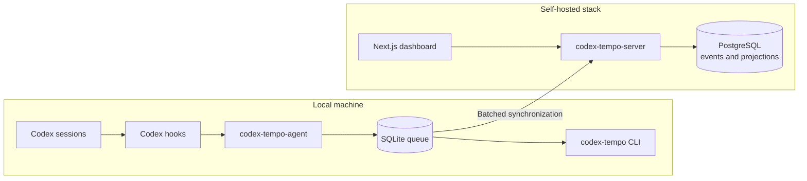

# Codex Tempo

[](https://github.com/mrksph/codex-tempo/actions/workflows/ci.yml)
[](LICENSE)

Codex Tempo is self-hosted time tracking for parallel Codex sessions.

It records agent time, project span, wall-clock time, token usage, and concurrency without flattening independent sessions into a single activity stream.

## Why It Exists

Traditional activity trackers assume that work happens in one linear stream.

Codex workflows often involve:

* Multiple agent sessions running at the same time
* Separate worktrees for independent tasks
* Overlapping activity across projects
* Sessions running on more than one machine

Flattening that activity into a single heartbeat stream loses attribution and can produce misleading totals.

Codex Tempo answers questions such as:

* How much agent time did each project consume?
* What was the real wall-clock duration after removing overlap?
* Which sessions were active at the same time?
* What was the peak level of parallelism?
* How much agent activity occurred compared with the total calendar span?
* How many tokens did each session or project use?

## Time Model

Codex Tempo keeps several related metrics separate:

* **Agent time** is the accumulated active time across independent sessions.
* **Wall-clock time** counts overlapping intervals only once.
* **Project span** represents the calendar span covered by a project's recorded activity.
* **Concurrency** is the number of sessions active during the same interval.
* **Peak parallelism** is the highest observed concurrency.

This distinction matters whenever sessions overlap.

## Example

Two sessions can overlap without losing attribution:

```text
Project A: 10:00-10:20
Project B: 10:05-10:25

Agent time        40 min
Wall-clock time   25 min
Peak parallelism   2
```

The sessions account for 40 minutes of agent time, while only 25 minutes pass on the clock.

## What It Includes

* A Go agent with incremental Codex JSONL parsing and a local SQLite queue
* A Go API with PostgreSQL, idempotent ingestion, and deterministic projection
* A Next.js dashboard with project charts, timelines, filtering, and live polling
* Token usage and concurrency tracking
* Hook diagnostics with daily rotation and 14-day retention
* Worktree-aware project resolution for repositories with linked worktrees
* Offline reports and diagnostics against the local database

## Architecture



The system is split into three main layers.

### `codex-tempo-agent`

The agent runs locally on each machine.

It:

* Captures Codex activity
* Parses Codex JSONL incrementally
* Resolves projects and linked worktrees
* Stores pending data in a local SQLite queue
* Synchronizes event batches with the server
* Imports existing sessions during setup

The local queue allows batches to be synchronized later rather than requiring every event to reach the server immediately.

### `codex-tempo-server`

The server accepts immutable events and rebuilds projections from them.

It provides:

* Idempotent event ingestion
* PostgreSQL persistence
* Deterministic projection rebuilding
* Data consumed by the dashboard

Time calculations remain in Go rather than being reimplemented in the browser.

### `codex-tempo`

The local CLI provides reports and diagnostics against the SQLite database.

It can be used independently of the dashboard for local inspection and troubleshooting.

The dashboard uses a backend-for-frontend architecture over the Go services.

## Requirements

### Self-Hosted Deployment

* Docker Engine with Docker Compose
* A recent browser for the dashboard
* One or more machines with Codex hooks or the local agent installed

### Local Builds

* Go 1.24 or newer
* Node.js 24 or newer
* pnpm 9 or newer

## Quick Start

### 1. Create the environment file

Copy the example environment file:

```bash
cp .env.example .env
```

Open `.env` and configure the deployment values and secrets.

### 2. Start the stack

```bash
docker compose \
  --env-file .env \
  -f deploy/compose/docker-compose.yml \
  up --build
```

### 3. Open the dashboard

```text
http://localhost:3100
```

Sign in using the value configured in `WEB_PASSWORD`.

### 4. Configure a machine

Open the dashboard settings page and create or copy the agent setup key.

Run:

```bash
codex-tempo-agent configure \
  --server-url http://localhost:8080 \
  --api-key "$AGENT_SETUP_KEY"
```

The setup command:

1. Registers the machine
2. Stores its dedicated token locally
3. Imports existing sessions
4. Performs the first synchronization

The setup key itself is not retained.

Repeat the process for each machine that should report activity.

If you want to point the agent at a different server without editing
`~/.config/codex-tempo/config.toml`, export:

```bash
export CODEX_TEMPO_SERVER_URL=http://localhost:8080
export CODEX_TEMPO_MACHINE_TOKEN=...
```

Those environment variables override the persisted values at runtime, which is
useful when switching between a production deployment and a local test server.

## Local Agent and CLI

Build the local tools from source:

```bash
go build -o bin/codex-tempo-agent ./apps/agent
go build -o bin/codex-tempo ./apps/cli
```

Run one agent collection and synchronization cycle:

```bash
bin/codex-tempo-agent --once
```

Generate a report for the current day:

```bash
bin/codex-tempo report today
```

Run local diagnostics:

```bash
bin/codex-tempo doctor
```

Default local paths:

```text
Configuration: ~/.config/codex-tempo/config.toml
Database:      ~/.local/share/codex-tempo/tempo.db
```

## Configuration

The example agent configuration is available at:

[`deploy/examples/config.toml`](./deploy/examples/config.toml)

Relevant runtime settings include:

| Setting                 | Purpose                                             |
| ----------------------- | --------------------------------------------------- |
| `hook_sync_interval`    | Controls the synchronization interval.              |
| `hook_activity_timeout` | Controls when hook activity is considered inactive. |
| `log_retention`         | Controls diagnostic log retention.                  |
| `privacy.store_paths`   | Enables path storage when explicitly configured.    |

The production Compose stack uses values including:

| Variable             | Purpose                             |
| -------------------- | ----------------------------------- |
| `POSTGRES_PASSWORD`  | PostgreSQL password                 |
| `AGENT_SETUP_KEY`    | Initial machine registration key    |
| `INTERNAL_API_TOKEN` | Internal API authentication         |
| `WEB_PASSWORD`       | Dashboard sign-in password          |
| `AUTH_SECRET`        | Web authentication secret           |
| `PUBLIC_API_URL`     | API URL used by the web application |
| `TZ`                 | Deployment timezone                 |
| `WEB_PORT`           | Dashboard port                      |
| `API_PORT`           | API port                            |

Use [`.env.example`](./.env.example) as the source of truth for the complete configuration and any defaults.

If the dashboard is served over plain HTTP, leave `AUTH_COOKIE_SECURE` unset
or set it to `false`. When the app is behind HTTPS and sends
`x-forwarded-proto: https`, the session cookie is marked secure automatically.

## Privacy

Codex Tempo collects operational metadata rather than session content by default.

* Prompts are not stored.
* Responses are not stored.
* Reasoning is not stored.
* Tool output is not stored.
* File content is not stored.
* Worktree names and linked-worktree metadata are stored.
* Paths are stored only when `privacy.store_paths` is enabled.
* Hook logs remain local.
* Hook logs are written with restrictive permissions.

See [`docs/privacy.md`](./docs/privacy.md) for additional details.

## Verification

The CI workflow runs:

```bash
go vet ./...
go test -race ./...
go build ./apps/agent ./apps/cli ./apps/server
pnpm lint
pnpm typecheck
pnpm build
```

The repository keeps focused unit tests around:

* Incremental JSONL parsing
* Project and worktree resolution
* Local SQLite storage
* Synchronization
* Hook logging
* Diagnostic paths

Coverage should be reported by CI or a generated badge rather than maintained as a fixed number in this README.

## Documentation

* [`CONTRIBUTING.md`](./CONTRIBUTING.md)
* [`docs/architecture.md`](./docs/architecture.md)
* [`docs/deployment-dokploy.md`](./docs/deployment-dokploy.md)
* [`docs/event-model.md`](./docs/event-model.md)
* [`docs/privacy.md`](./docs/privacy.md)

## Contributing

Contributions are welcome, including:

* Bug reports
* Documentation improvements
* Feature suggestions
* Code changes
* Test coverage improvements

Before working on a significant change, open an issue to discuss the proposal. This helps avoid duplicated work and keeps the change within the project's scope.

For a code contribution:

1. Fork the repository.

2. Create a branch for the change.

3. Keep the change focused.

4. Avoid unrelated refactoring.

5. Format and verify the code:

   ```bash
   go fmt ./...
   go vet ./...
   go test ./...
   ```

6. Open a pull request explaining:

   * What the change does
   * Why it is needed
   * How it was tested

Small, focused pull requests are easier to review and merge.

## Feedback

Use GitHub Issues for:

* Bug reports
* Documentation gaps
* Feature requests
* Reproducible operational problems

Include the relevant command, environment, logs, and reproduction steps when possible.

If GitHub Discussions are enabled later, use them for broader design questions.

## Notes

* The project is intended to be self-hosted first.
* The public default branch is `master`.
